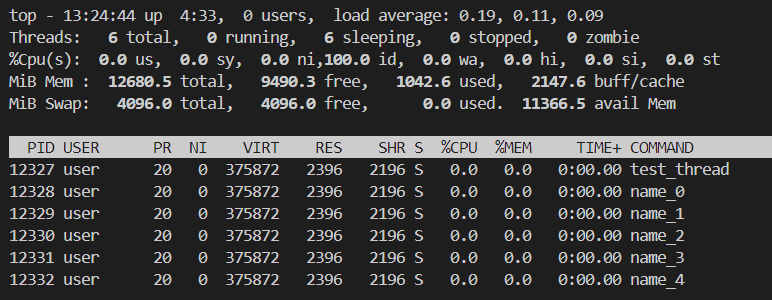
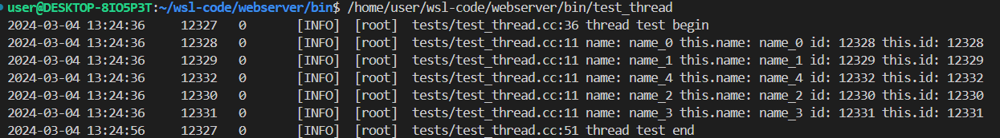

# webserver

## 项目路径

bin --  二进制

bulid -- 中间文件路径

cmake -- cmake函数文件夹

CMakeList.txt -- cmake定义文件

lib -- 库得输出路径

Makefile -- 

sylar -- 源代码路径

tests -- 测试代码

## 日志系统

服务器出问题、做统计

1)
    Log4J


    Logger(定义日志类别)
    -Formatter(日志格式)

    Appender(日志输出地方)（控制台、文件、专门日志收集系统）


    框架级log用唯一标识区分，业务级用另外名称定义
    - 可控


## 配置系统

Config --> Yaml

yamp-cpp

```cpp
YAML::Node node = YAML::LoadFile(filename)
node.IsMap()
for(auto it = node.begin();
        it != node.end(); it++){
            it->first, it->seconde
        }

node.IsSequence()
```

配置系统原则：约定优于配置

```cpp

template<T, FromStr, ToStr>
class ConfigVar;

template<F, T>
LexicalCast;

//容器片特化 vector, list, set, map, unordered_set, unordered_map
// map、unordered_map 需要支持 key = std::string
// Config::Lookup(key), key相同， 类型不同

/*
容器偏特化（template specialization for containers）是C++模板编程中的一个概念。
它指的是对特定类型的模板进行特殊处理或定制，以满足特定的需求。
代码中，存在两个类模板的片特化：

LexicalCast<std::string, std::vector<T>>：
这是对 LexicalCast 模板的特殊版本，用于将 YAML 格式的字符串转换为 std::vector<T> 类型的对象。

LexicalCast<std::vector<T>, std::string>：
这是另一个 LexicalCast 模板的特殊版本，用于将 std::vector<T> 类型的对象转换为 YAML 格式的字符串。

在这两种情况下，为了更好地处理特定的类型转换，对通用的 LexicalCast 模板进行了特殊化。
这使得可以为这两个特殊情况提供定制的实现，以满足程序的需求。
这种特殊化允许根据不同的类型执行不同的操作，提高了代码的灵活性和可读性。
*/

```

自定义类型，需要实现webserver::LexicalCast,偏特化
实现后，可以支持Config解析自定义类型
自定义类型可以和常规stl容器一起使用

配置的事件机制
当一个配置项发生修改的时候，可以反向通知对应的代码，回调

### 日志系统整合配置系统

```yaml
logs:
    - name: root
      level: (debug,,info, warn, error, fatal)
      formatter: "%d%T%p%T%t%m%n" 
      appender:
            - type: (StdoutLogAppender, FileLogAppender)
              level: (debug, ...)
              file: /logs/xxx.log

```

```cpp

webserver::Logger g_logger = webserver::LoggerMgr::GetInstance()->getLogger(name);
WEBSERVER_LOG_INFO(g_logger) << "xxxx log";

```

```cpp
// 保证log唯一性
static Logger::ptr g_log = WEBSERVER_LOG_NAME("system");
// m_root, m_system->m_root
// 当logger的appenders为空，使用root写logger
```
```cpp
// 定义LogDefine LogAppenderDefine，偏特化 LexicalCast
// 实现日志配置解析
```

```cpp

```

## 线程库封装

线程 C++11
互斥量 pthread线程库
既能用到新特性，又可以兼顾性能

pthread实现pthread_creatre
互斥量 mutex 
信号量 semaphore
C++11中的互斥量没有读写分离，高并发情况下，写少读多，将读写分离，提升性能

信号量用在pthread生成线程中，在线程构造函数中，确保在出线程构造函数之前，要启动的线程就一定启动。

与Log整合，Logger, Appender

Spinlock替换Mutex
写文件，周期性，reopen

与Config整合

```bash
ps uax | grep thread
```
这个命令的意思是列出所有进程 (ps uax)，然后使用 grep 过滤输出，只显示包含单词 "thread" 的行。

```bash
top -H -p <进程ID>
```
top 命令用于显示系统中运行的进程和系统资源的使用情况。-H 选项表示显示线程信息，-p 选项用于指定要监视的进程 ID。如果你想要监视特定进程的线程，你需要提供一个有效的进程 ID。例如：






## 协程库封装

将异步操作封装成同步

定义协程接口
ucontext_t
macro

协程比线程更轻量级
用户态的线程，可创建的数量是线程的成千上万倍
轻量级，切换速度快，操作权掌握在用户手中

```
Fiber::GetThis()
thread->main_fiber <--> sub_fiber
            ↑
            |
            ↓
        sub_fiber
```


协程调度模块scheduler
```   
          1 - N      1 - M       
scheduler  --> thread --> fiber

1. 线程池， 分配一组线程
2. 协程调度器，将协程指定到相应的线程上去执行

m_threads 线程池
<function<void()>, fiber, threadid> m_fibers  协程队列

schedule(func/fiber)

start()
stop()  协程调度器所有任务结束后退出
run()  核心 协程和线程

run() 
1.设置当前线程的scheduler
2.设置当前线程执行run方法的fiber
3.协程调度循环while(true)
    3.1 协程消息队列是否有 任务
    3.2 无任务执行，执行idle

```

```
IOManager(epoll) --->Scheduler
            |
            |
            ↓
           idle(epoll_wait)

信号量
PutMessage(msg, ) + 信号量1, single()
message_queue
     |
     | ----- Thread
     | ----- Thread
           wait()-信号量1, RecvMessage(msg, )

异步IS，等待数据返回。 epoll_wait

epoll_create, epoll_ctl, epoll_wait
```

```
Timer -> addTimer() --> cancel()
获取当前的定时器触发离现在的时间差
返回当前需要触发的定时器
```


```
                [Fiber]                   [Timer]
                   ↑N                       ↑
                   |                        |
                   |1                       |
                [Thread]               [TimerManager]
                   ↑M                       ↑
                   |                        |
                   |1                       |
                [Scheduledr] <----  [IOManager(epoll)]

```

## HOOK

sleep
usleep

socket相关 : socket, connet, accept
io相关 : read, wirte, send, recv
fd相关 : fcntl, ioctl

## socket函数库

              [UnixAddress]
                    |
                ---------                      | - [IPv4Address]
                |Address|  --- [IPAddress] --- |
                ---------                      | - [IPv6Address]
                    |
                    |
                ---------
                 |Socket|
                ---------

connetc
accept
read/wirte/clses   


## 序列化bytearry

write(int, float, ...)
read(int, float, ...)
                
## http协议开发

HTTP/1.1 - API

HttpRequest
HttpResponse


GET / HTTP/1.1
host: www.baidu.com

HTTP/1.0 200 OK
Pragma: no-cache
Content-Type: text/html
Content-Length: 14988
Connection: close

url: http://www.baidu.com:80/page/xxx?id=10&v=20#fr
    协议 : http
    host : www.baidu.com
    port : 80
    path : xxx
    param : id=10&v=20
    fragment : fr


## 分布式协议

业务功能、系统功能分开

## 推荐系统

